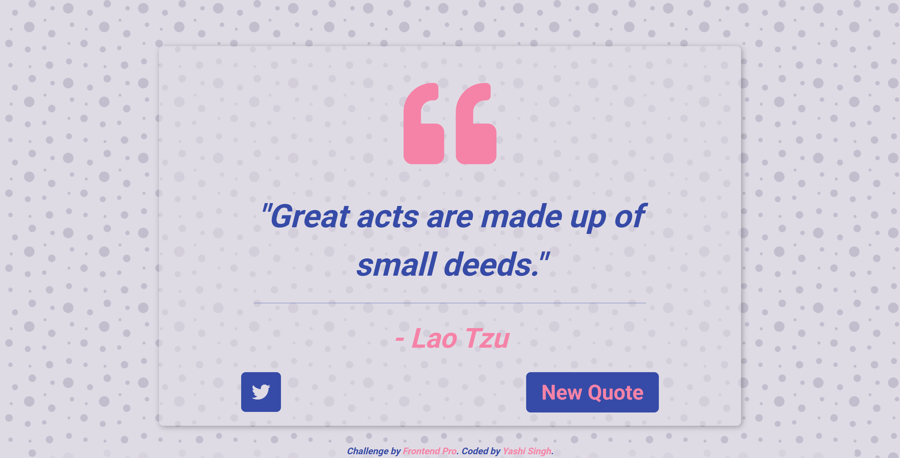

# Random Quote Generator


This is a solution to the [Random Quote Generator Challenge](https://www.frontendpro.dev/frontend-coding-challenges/random-quote-generator-8L8ocgPccZaBeqLjpSLK) on Frontend Pro. The project generates random quotes dynamically from an external API and allows users to tweet them easily.

---

## Table of Contents

- [Overview](#overview)
  - [Features](#features)
  - [Screenshots](#screenshots)
  - [Links](#links)
- [Installation and Running](#installation-and-running)
  - [Installing the Less Preprocessor](#installing-the-less-preprocessor)
- [Built With](#built-with)
- [What I Learned](#what-i-learned)
- [Author](#author)
- [Acknowledgments](#acknowledgments)

---

## Overview

### Features

- Fetches **random quotes** from the ZenQuotes API.
- Displays **quotes dynamically** on the webpage.
- Allows users to **generate new quotes** by clicking a button.
- Provides a **Twitter share button** to tweet quotes easily.
- Responsive design using **Bootstrap 5**.

### Screenshots

#### Desktop Version


#### Mobile Version


### Links

- **Live**: [Live Demo](#)
- **Solution**: [Solution](#)

---

## Installation and Running

### Prerequisites

Ensure you have the following installed:

1. **Node.js and npm** (for Less preprocessor compilation)
2. **A code editor** like Visual Studio Code
3. **A web browser** to view the project

### Steps

1. **Clone the Repository**
   ```bash
   git clone https://github.com/Yashi-Singh-9/Random-Quote-Generator.git
   ```

2. **Navigate to the Project Directory**
   ```bash
   cd Random-Quote-Generator
   ```

3. **Install the Less Preprocessor** (if not installed already)
   ```bash
   npm install -g less
   ```

4. **Compile Less to CSS**
   ```bash
   lessc style.less style.css
   ```

5. **Run the Project**
   - Open `index.html` in your browser.
   - Or use VS Code's Live Server extension:
     ```bash
     npx live-server
     ```

---

## Built With

- **HTML5** - For structuring the content.
- **Bootstrap 5** - For styling and layout.
- **JavaScript (ES6+)** - For fetching and displaying quotes dynamically.
- **Less** - For preprocessed and organized styling.
- **ZenQuotes API** - For fetching random quotes.

---

## What I Learned

This project enhanced my understanding of:

- **Fetching data from an API** using `fetch()` with async/await.
- **Handling API errors** and displaying fallback messages.
- **Using Bootstrap 5** for responsive layouts.
- **Implementing Less** for modular and reusable styles.

---

## Author

- Frontend Pro Profile: [Yashi-Singh-9](https://www.frontendpro.dev/profile/Yashi-Singh-9)
- LinkedIn: [Yashi Singh](https://www.linkedin.com/in/yashi-singh-b4143a246)

---

## Acknowledgments

- **Frontend Pro** for providing great challenges.
- **ZenQuotes API** for inspiring quotes.
- **Bootstrap Documentation** for styling guidance.